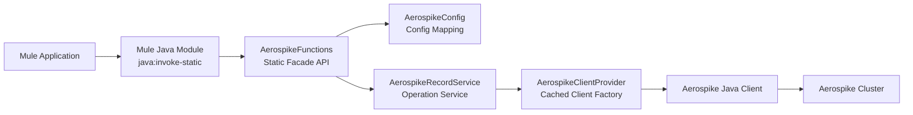
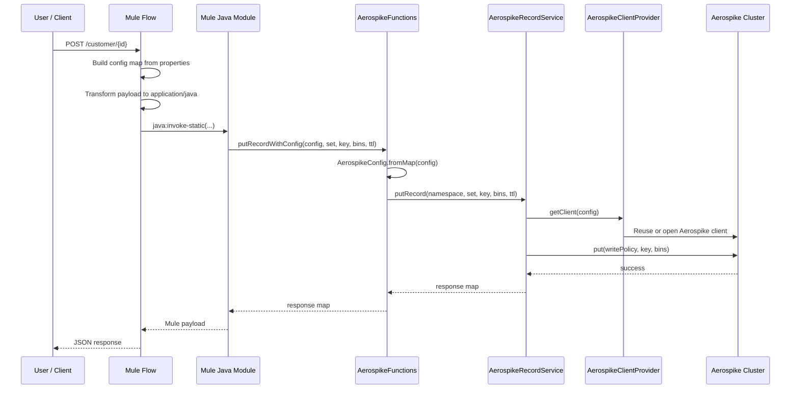
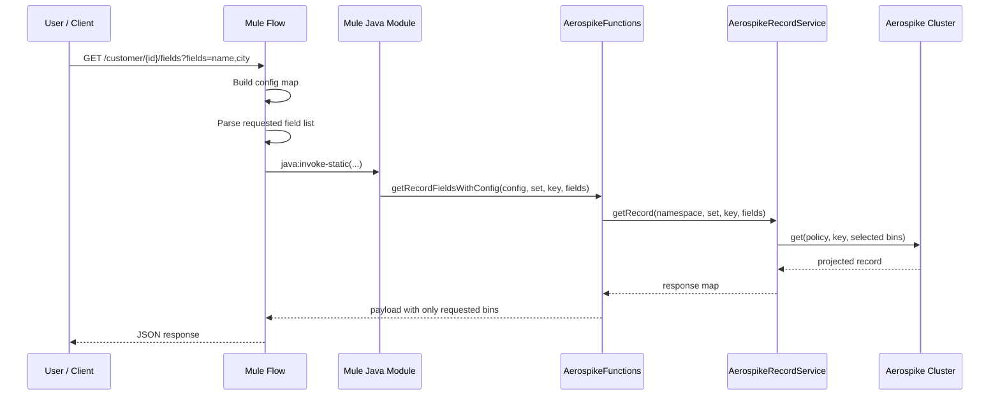
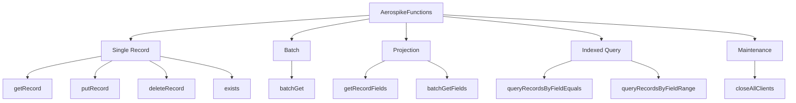
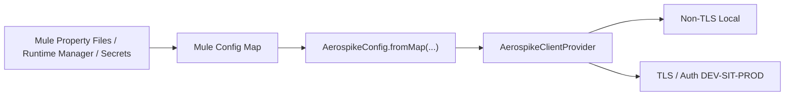
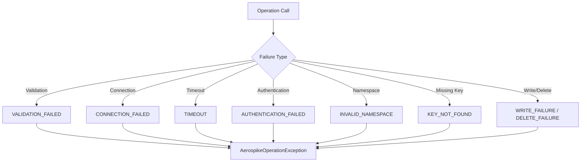

# Aerospike Client Library Architecture

This document describes the design, runtime flow, and integration model of `aerospike-client-lib`.

## 1. Purpose

`aerospike-client-lib` is a plain Java Maven JAR used by Mule applications through Mule Java Module static method calls.

It is not a Mule SDK connector and it does not appear as a custom palette connector.

Its responsibilities are:

- provide Mule-friendly static methods
- convert Mule config into Java configuration
- manage Aerospike client reuse
- execute Aerospike record operations
- return simple Java `Map` / `List<Map>` responses to Mule

## 2. High-Level Architecture



## 3. Package Structure

```text
com.idfcfirstbank.aerospike
|- api
|  \- AerospikeFunctions
|- config
|  \- AerospikeConfig
|- exception
|  |- AerospikeErrorType
|  |- AerospikeExceptionMapper
|  \- AerospikeOperationException
|- model
|  \- AerospikeResponse
|- service
|  |- AerospikeClientProvider
|  \- AerospikeRecordService
\- util
   \- AerospikeValidation
```

## 4. Component Responsibilities

### `AerospikeFunctions`

Static entry point for Mule.

Responsibilities:
- expose Mule-friendly methods
- support simple host-based calls and config-map-based calls
- expose projection and query methods
- hide service construction from Mule developers

Examples:
- `getRecordWithConfig(...)`
- `putRecordWithConfig(...)`
- `getRecordFieldsWithConfig(...)`
- `batchGetFieldsWithConfig(...)`
- `queryRecordsByFieldEqualsWithConfig(...)`

### `AerospikeConfig`

Configuration model for:
- hosts
- namespace
- TLS
- auth
- timeouts
- connection pool values
- truststore / keystore

It supports:
- direct Java construction
- `fromMap(...)` for Mule config maps

### `AerospikeRecordService`

Core record operation service.

Responsibilities:
- validate inputs
- build Aerospike keys, bins, statements, and policies
- perform single record, batch, projection, and query operations
- normalize Mule numeric values before writes

### `AerospikeClientProvider`

Client lifecycle and caching layer.

Responsibilities:
- create Aerospike client from config
- reuse clients across calls
- support TLS and auth setup
- cache one client per effective config

### `AerospikeResponse`

Creates response payloads returned to Mule.

Responsibilities:
- normalize success/found/exists response shape
- return bins and metadata

### `AerospikeExceptionMapper`

Maps Java and Aerospike exceptions into one application exception model.

Responsibilities:
- validation failure mapping
- timeout mapping
- connection failure mapping
- authentication failure mapping

## 5. End-to-End Request Flow

### Example: Put Record



### Example: Get Selected Fields



## 6. Supported Operation Families



## 7. Environment Configuration Flow

The same code path is used in local, DEV, SIT, and PROD. Only config values change.



Typical local config:

```text
hosts=localhost:3000
namespace=test
tlsEnabled=false
authEnabled=false
```

Typical secured environment config:

```text
hosts=prod-host-1:4333,prod-host-2:4333
namespace=prod_namespace
tlsEnabled=true
authEnabled=true
tlsName=cluster_tls_name
username=${AEROSPIKE_USERNAME}
password=${AEROSPIKE_PASSWORD}
trustStorePath=/path/to/truststore.jks
```

## 8. Data Model Notes

For Mule teams:

- Aerospike `set` is often thought of like a table
- Aerospike `bin` is often thought of like a column
- record primary key is not the same as a relational primary key column

Projection support means:

- if a record has 5 bins
- Mule can request only 2 or 4 bins
- the utility returns only those selected bins

## 9. Query Model Notes

The utility supports:

- equality query on an indexed bin
- numeric range query on an indexed bin

Important constraints:

1. Aerospike query methods are not SQL.
2. Filtered query bins must have secondary indexes.
3. Equality query currently supports non-blank `String` and integer `Number`.
4. Range query currently supports integer numeric bounds.

Example local index creation:

```sql
CREATE INDEX idx_customer_city ON test.customer (city) STRING
CREATE INDEX idx_customer_visits ON test.customer (visits) NUMERIC
```

## 10. Error Handling Flow



## 11. Runtime Characteristics

### Strengths

- plain Java JAR, simpler than Mule SDK connector packaging
- easy Mule Java Module invocation
- reusable across environments
- cached client reuse
- projection support for selected bins
- simple response format for Mule

### Tradeoffs

- not a Mule palette connector
- no custom Mule operation UI
- errors are Java exceptions, not Mule-native custom connector errors
- query support depends on Aerospike indexing rules

## 12. Recommended Mule Usage Pattern

Preferred Mule pattern:

1. build one config map from properties
2. transform incoming JSON payload to `application/java` for write calls
3. invoke `AerospikeFunctions` static method
4. handle `JAVA:INVOCATION` in Mule error handling where needed

Recommended method family for Mule:

```text
putRecordWithConfig(...)
getRecordWithConfig(...)
getRecordFieldsWithConfig(...)
existsWithConfig(...)
batchGetWithConfig(...)
batchGetFieldsWithConfig(...)
queryRecordsByFieldEqualsWithConfig(...)
queryRecordsByFieldRangeWithConfig(...)
```

## 13. Summary

This utility follows a layered design:

- Mule-facing static API
- config mapping
- operation service
- cached client provider
- Aerospike client and cluster

That keeps the Mule integration simple while preserving a clean internal Java design.
